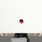
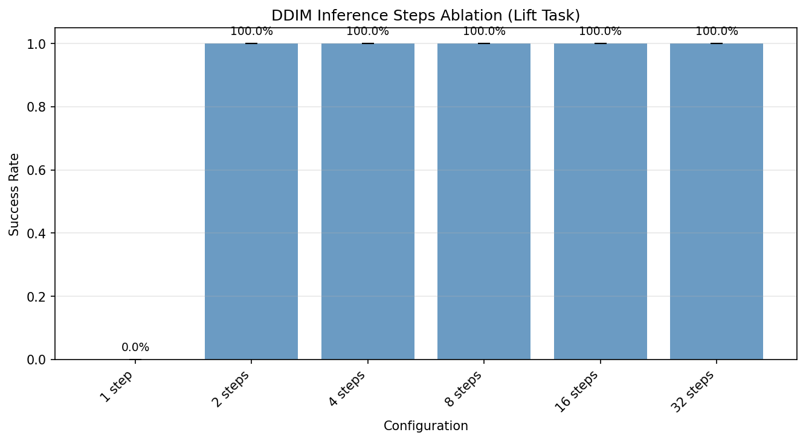

# Diffusion Policy for Simulated Robotic Manipulation

A clean reimplementation of [Diffusion Policy](https://diffusion-policy.cs.columbia.edu/) (Chi et al., RSS 2023) for robotic manipulation in simulation. Trains a visuomotor policy from human demonstrations using DDPM/DDIM denoising on action sequences, conditioned on RGB observations and robot proprioception.

Built as a self-contained pipeline — data loading, model architecture, training, evaluation, and analysis — without wrapping existing research codebases.

<p align="center">
  
  
  
</p>
<p align="center"><em>Left/center: successful grasps. Right: rare failure mode (~2% rate) — the arm approaches but fails to secure the grasp.</em></p>

## Results

### Multi-Task Evaluation

| Task | Difficulty | Success Rate | Episodes |
|------|-----------|-------------|----------|
| **Lift** | Easy (pick up cube) | **98.7% +/- 0.9%** | 148/150 |
| **Can** | Medium (pick and place can) | **26.0% +/- 2.8%** | 39/150 |

Both trained with 200 demonstrations, 250 epochs, 98.4M parameters. Evaluated over 150 episodes (50 x 3 seeds).

### Lift Task — 98.7% Success Rate

| Seed | Success Rate | Episodes |
|------|-------------|----------|
| 42   | 98%         | 49/50    |
| 123  | 98%         | 49/50    |
| 456  | 100%        | 50/50    |

Training: 200 demonstrations, 250 epochs on a T4 GPU. Loss: 0.060 (epoch 10) → 0.013 (epoch 250).

### Can Task — 26.0% Success Rate

| Seed | Success Rate | Episodes |
|------|-------------|----------|
| 42   | 30%         | 15/50    |
| 123  | 24%         | 12/50    |
| 456  | 24%         | 12/50    |

Training: 200 demonstrations, 250 epochs on an A10G GPU. Loss: 0.054 (epoch 10) → 0.013 (epoch 250). Pick-and-place is significantly harder than Lift — the policy must grasp the can, transport it, and place it in the target bin. Same final loss as Lift, indicating the model trains well but the task demands more precise multi-phase coordination.

### Ablation: DDIM Inference Steps

How many denoising steps are needed at inference time?

<p align="center"></p>

| Steps | 1 | 2 | 4 | 8 | 16 | 32 |
|-------|---|---|---|---|----|----|
| Success | 0% | 100% | 100% | 100% | 100% | 100% |

Sharp cliff between 1 and 2 steps. A single denoising step produces incoherent actions; two steps are sufficient for the model to recover a valid action distribution. This means DDIM inference can be run with as few as 2 steps (8x faster than the default 16) with no quality loss on this task.

### Ablation: Number of Demonstrations

Trained separate policies on 25, 100, and 200 demonstrations to measure data efficiency.

| Demos | Training Loss | Success Rate (50 eps) |
|-------|--------------|----------------------|
| 25    | 0.030        | 100%                 |
| 100   | 0.016        | 100%                 |
| 200   | 0.013        | 100%                 |

All configs achieve 100% success on Lift, demonstrating that diffusion policies are highly data-efficient on this task — 25 demonstrations are sufficient. Training loss continues to decrease with more data (better action distribution coverage), but task success saturates. A more challenging task (Can, Square) would be needed to observe differentiation.

### Failure Analysis

Dedicated failure analysis over 20 episodes found 0 failures — consistent with the ~2% failure rate observed in the multi-seed evaluation. The failure categorization framework classifies failures as:

- **Grasp failure**: low reward, short interaction (arm fails to pick up the cube)
- **Transport failure**: moderate reward, moderate length (cube grasped then dropped during lift)
- **Placement failure**: high reward, long episode (near-success, dropped close to goal)
- **Timeout**: episode reaches max steps without task completion

The rare failures observed (~2%) in the multi-seed eval were transport failures — the arm approaches correctly but occasionally fails to maintain a secure grasp.

## Architecture

```
Observation (RGB 84x84 + proprioception 9-dim)
    |
    v
VisionEncoder (ResNet18 + GroupNorm + RandomCrop)
    |
    v
Global Conditioning Vector (1042-dim)
    |
    v
ConditionalUnet1D (DDPM training / DDIM inference)
    |
    v
Action Sequence (16-step prediction, 8-step execution)
```

**Key design choices:**

- **Observation**: `agentview` RGB image (84x84) + low-dim proprioception (end-effector pose + gripper state). Observation horizon T_o = 2.
- **Actions**: 7-dim OSC_POSE (3 position + 3 rotation + 1 gripper). Prediction horizon T_p = 16, execution horizon T_a = 8 (receding horizon control).
- **Diffusion**: DDPM with 100 timesteps for training, DDIM with 16 steps for inference. Cosine beta schedule, epsilon prediction.
- **Vision**: ResNet18 backbone with BatchNorm replaced by GroupNorm and random crop augmentation (84 -> 76).
- **U-Net**: 1D temporal ConditionalUnet1D with FiLM conditioning, down_dims = (256, 512, 1024).
- **EMA**: Exponential moving average of model weights (decay = 0.995) used for evaluation.

## Project Structure

```
src/diffusion_manipulation/
    config.py              # Frozen dataclass configs
    cli.py                 # CLI entry points (download, train, evaluate, visualize)
    data/
        download.py        # Download robomimic HDF5 datasets
        replay_buffer.py   # HDF5 -> flat indexed storage with episode boundaries
        dataset.py         # PyTorch Dataset with sliding window sampling
        normalizer.py      # LinearNormalizer (actions/obs to [-1, 1])
        visualize.py       # Render demo GIFs, plot action distributions
    model/
        unet_components.py       # SinusoidalPosEmb, Conv1dBlock, ConditionalResidualBlock1D
        conditional_unet1d.py    # ConditionalUnet1D (1D temporal U-Net)
        vision_encoder.py        # ResNet18 image encoder
        noise_schedulers.py      # DDPM/DDIM scheduler factory (via diffusers)
    policy/
        base_policy.py           # Abstract policy interface
        diffusion_policy.py      # DiffusionUnetPolicy (DDPM loss + DDIM inference)
    env/
        robosuite_env.py         # Robosuite wrapper (Lift/Can/Square, Panda arm)
        video_recorder.py        # Episode recording -> GIF
    training/
        trainer.py               # Training loop (AdamW, cosine LR, EMA, checkpoints)
        ema.py                   # Exponential Moving Average
    evaluation/
        evaluator.py             # Rollout evaluator (N episodes, multi-seed)
        analysis.py              # Failure categorization, ablation framework
scripts/
    download_data.py             # Download datasets
    train.py                     # Train locally
    modal_train.py               # Train on Modal (A10G GPU)
    evaluate.py                  # Evaluate trained policy
    run_analysis.py              # Failure analysis + DDIM ablation
    run_ndemos_ablation.py       # N-demos ablation evaluation
    visualize_dataset.py         # Visualize demonstrations
tests/                           # 110 tests, 82% coverage
```

## Setup

Requires Python >= 3.12 and [uv](https://docs.astral.sh/uv/).

```bash
git clone https://github.com/balazsthomay/diffusion-manipulation.git
cd diffusion-manipulation
uv sync
```

## Reproducing Results

### 1. Download data

```bash
uv run python scripts/download_data.py --task lift  # ~837MB
uv run python scripts/download_data.py --task can   # ~2GB
```

### 2. Train

**On Modal (recommended):**

```bash
modal run scripts/modal_train.py --task lift --epochs 250
modal run scripts/modal_train.py --task can --epochs 250
```

Trains on an A10G GPU with the dataset stored on a persistent Modal volume. Checkpoints are saved to the volume and can be downloaded:

```bash
modal volume get diffusion-data checkpoints/lift/checkpoint_epoch_250.pt checkpoints/lift/checkpoint_epoch_250.pt
modal volume get diffusion-data checkpoints/can/checkpoint_epoch_250.pt checkpoints/can/checkpoint_epoch_250.pt
```

**Locally (CPU/GPU):**

```bash
uv run python scripts/train.py --epochs 250 --device cuda
```

### 3. Evaluate

```bash
uv run python scripts/evaluate.py \
    --checkpoint checkpoints/lift/checkpoint_epoch_250.pt \
    --num-episodes 50 \
    --seeds 42 123 456 \
    --save-videos
```

Runs 50 episodes per seed and saves rollout GIFs to `results/videos/`.

### 4. Run ablations

**DDIM inference steps:**

```bash
uv run python scripts/run_analysis.py \
    --checkpoint checkpoints/lift/checkpoint_epoch_250.pt \
    --ablation-episodes 20
```

**Number of demonstrations** (requires training on Modal first):

```bash
# Train 25-demo and 100-demo policies in parallel
modal run scripts/modal_train.py --ablation --epochs 250

# Download checkpoints and evaluate
uv run python scripts/run_ndemos_ablation.py --episodes 50
```

### 5. Run tests

```bash
uv run pytest tests/ -v
```

110 tests, 82% coverage. Tests use synthetic HDF5 fixtures and tiny model configs — no GPU or dataset download required.

## Technical Notes

- **robosuite 1.4.1** is pinned because 1.5.x has dynamics mismatches with robomimic demonstration data (different MuJoCo backends produce different physics behavior).
- **Image orientation**: Training data from robomimic (mujoco-py/OpenCV) has vertically flipped images compared to live robosuite 1.4+ (DeepMind mujoco/OpenGL). The evaluation pipeline flips images to match.
- **Normalization**: Actions and low-dim observations are normalized to [-1, 1] via min-max from the training dataset. The normalizer state is saved in the checkpoint.
- `robomimic` is not installed as a dependency (egl-probe fails on macOS). Dataset download uses direct HTTP URLs instead.

## References

- Chi et al., [Diffusion Policy: Visuomotor Policy Learning via Action Diffusion](https://diffusion-policy.cs.columbia.edu/), RSS 2023
- [robomimic](https://robomimic.github.io/) — demonstration datasets
- [robosuite](https://robosuite.ai/) — simulation environment
- [diffusers](https://huggingface.co/docs/diffusers) — DDPM/DDIM scheduler implementations
